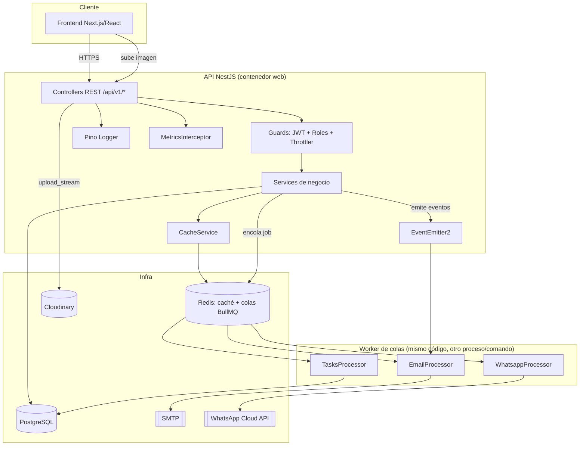
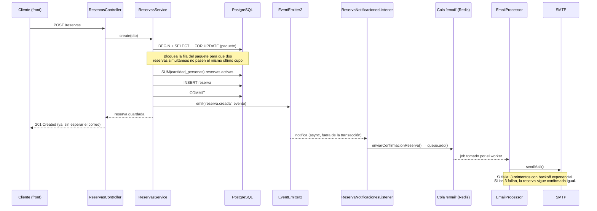

# Arquitectura

## Vista general

**Por qué esta forma:** el proceso web nunca espera a un SMTP o a la API
de Meta para responder — encola el trabajo en Redis (BullMQ) y sigue. El
worker que realmente envía los correos/WhatsApp puede correr en el mismo
proceso (`npm run start:prod`, más simple, sirve para el tráfico actual de
una agencia) o separado (`node dist/main.js` con una variable que
deshabilite las rutas HTTP) si el volumen crece — el código no cambia,
solo el comando de arranque.

## Flujo: crear una reserva

## Por qué cada pieza

| Pieza | Por qué | Alternativas consideradas |
|---|---|---|
| **Redis + CacheService a mano** (no `@nestjs/cache-manager`) | Una sola conexión compartida con BullMQ, invalidación por prefijo con `SCAN` (no bloquea Redis), cero dependencias de compatibilidad entre versiones de cache-manager y Nest 11. | `@nestjs/cache-manager` + `cache-manager-ioredis-yet`: más "estándar" pero una capa extra de abstracción para lo mismo. |
| **BullMQ** para email/WhatsApp/tareas | Reintentos con backoff, no bloquea la request HTTP, panel de administración disponible (Bull Board) si se quiere agregar después. | `@nestjs/schedule` a secas: sirve para el cron, pero no da reintentos ni desacopla el envío de la request. |
| **Cloudinary** para imágenes | Sin servidor/bucket que administrar, transformación automática (`quality: auto`, `fetch_format: auto`), plan gratis suficiente para el volumen de una agencia. | S3: más control pero hay que resolver policies IAM + un CDN aparte. MinIO: gratis y self-hosted, pero es un servicio más que mantener en el VPS. |
| **`@nestjs/event-emitter`** para reserva/cotización creada | Ya estaba instalado y sin usar. Desacopla "qué pasó" (una reserva se creó) de "qué hacer con eso" (mandar correo hoy; push notification o Slack mañana, sin tocar `ReservasService`). | CQRS completo (`@nestjs/cqrs`): mucho más ceremonia (command bus, handlers, sagas) para un dominio de este tamaño — se puede migrar después si el proyecto crece mucho. |
| **nestjs-pino** | Logs JSON parseables por el proveedor cloud, request-id automático, redacción de campos sensibles (`authorization`, `password`). | Winston: igual de válido; se eligió Pino por menor overhead (usa `pino`, que es más rápido serializando) y por la integración oficial `nestjs-pino`. |
| **Terminus + prom-client** | Terminus es el estándar de Nest para health checks (usado por el healthcheck de Railway/Render). prom-client expone `/metrics` en formato que cualquier Prometheus/Grafana Cloud puede scrapear directo. | Un endpoint `/health` hecho a mano: reinventa lo que Terminus ya resuelve (timeouts, formato de respuesta estándar). |

## Trade-offs conocidos (documentados a propósito, no descubiertos por accidente)

- **Caché de Paquetes/Ofertas**: se invalida por completo (`delByPrefix`)
  en create/update/remove, pero **no** en las operaciones de galería de
  imágenes (agregar/quitar imagen, marcar principal). Esas quedan hasta
  el TTL (5 min en Paquetes, 2 min en Ofertas) desactualizadas en el
  listado público. Se aceptó ese trade-off para no tener que tocar cada
  método de imágenes; si en el futuro se nota, se replica el patrón que
  ya tiene `DestinosService` (que sí invalida en cada método de imagen).
- **`/metrics` sin autenticación**: es lo que esperan los scrapers de
  Prometheus por defecto. No expone datos de negocio, pero si el
  despliegue lo requiere, hay que restringirlo por IP a nivel de
  proxy/load balancer del proveedor cloud (no a nivel de código).
- **Un solo proceso para HTTP + workers** en el arranque por defecto
  (`npm run start:prod`): es lo más simple para el volumen actual. Si las
  colas se saturan (muchos correos/WhatsApp a la vez), separar el worker
  a otro proceso/dyno es un cambio de configuración de despliegue, no de
  código (ver `docs/DESPLIEGUE.md`).
